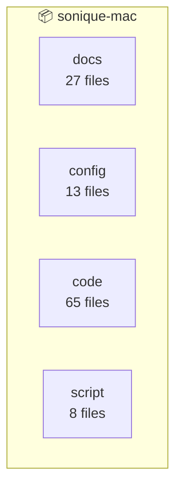
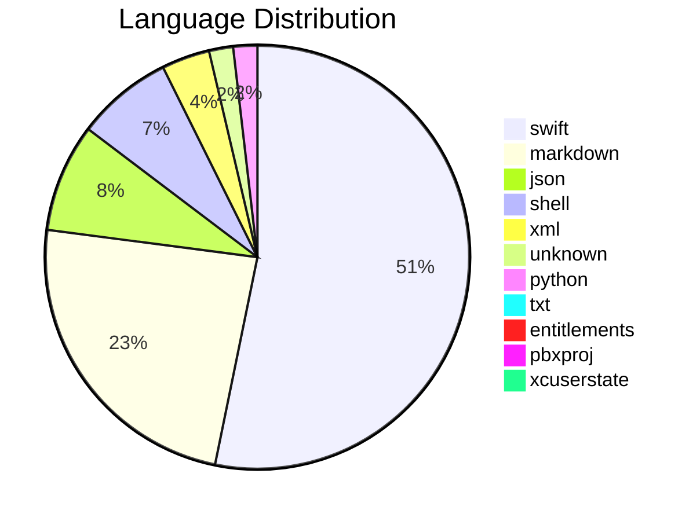

# Architecture Diagram: sonique-mac

**Files:** 113 | **Complexity:** moderate

## Project Structure



## Languages



## File Tree

```
.DS_Store
.architecture/
  ARCHITECTURE.md
.architecture/
  SUMMARY.md
.architecture/
  lore-response.json
.architecture/
    api-response.json
.architecture/
    import-input.json
.architecture/
    import-map.json
.architecture/
    scan-files.json
.lore/
  map.md
.understand-anything/
    ua-import-input.json
.understand-anything/
    ua-import-map.json
.understand-anything/
    ua-scan-files.json
AGENTS.md
ARCHITECTURE.md
BUILD-35-SUMMARY.md
BUILD_70_STATUS.md
CLEANUP.md
DEPENDENCIES.md
ExportOptions.plist
FINAL_STATUS.md
HANDOFF.md
IMPLEMENTATION-PLAN.md
IMPLEMENTATION_STATUS.md
JARVIS-ROADMAP.md
JARVIS-TODO.md
KOKORO_STATUS.md
LabStatusService.swift
MemoryService.swift
PRODUCTION-READY.md
PROJECT_HEADER.md
Package.swift
QUINN-ENHANCEMENTS.md
README.md
SoniqueBar.entitlements
SoniqueBar.xcodeproj/
  project.pbxproj
SoniqueBar.xcodeproj/
        UserInterfaceState.xcuserstate
SoniqueBar.xcodeproj/
        xcschememanagement.plist
SoniqueBar/
  .DS_Store
SoniqueBar/
  Backend.swift
SoniqueBar/
    DockerConnector.swift
SoniqueBar/
    GitHubConnector.swift
generate_xcodeproj.py
kokoro-service/
  README.md
kokoro-service/
  install-kokoro.sh
kokoro-service/
  main.py
kokoro-service/
  requirements.txt
scripts/
  archive-and-upload.sh
scripts/
  auto-deploy.sh
scripts/
  build-sidecar.sh
scripts/
  github-watcher.sh
```
